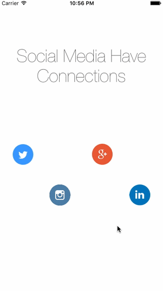

# Ouroboros

[](https://travis-ci.org/Draveness/Ouroboros)
[](http://cocoapods.org/pods/Ouroboros)
[](http://cocoapods.org/pods/Ouroboros)
[](http://cocoapods.org/pods/Ouroboros)


This is an Objective-C library for magical scroll interactions. Ouroboros is inspired by javascript third-party framework `scrollmagic`. You can create magical scroll interactions with `Ouroboros` in iOS App.

## Features

- [x] Different scroll direction support
- [x] UIView / Layer animation
- [x] Overlapping animation detect
- [x] Measure guide for UIView
- [x] Animation curve support
- [ ] Mac OS X support


## Demo

To run the example project, clone the repo, and run `pod install` from the Example directory first.



## Installation with CocoaPods

Ouroboros is available through [CocoaPods](http://cocoapods.org). To install
it, simply add the following line to your Podfile:

```ruby
pod "Ouroboros"
```

## Usage

```objectivec
#import "Ouroboros.h"
```

### Animate

Add animation to a `view` is extremely easy. `Ouroboros` provides a bunch of convience APIs on `UIView` through category. Directly invoke `our_animateWithProperty:configureBlock:` method of `UIView` instance.

```objectivec
view.backgroundColor = [UIColor redColor];
[view our_animateWithProperty:OURAnimationPropertyViewBackgroundColor
               configureBlock:^(Ouroboros *ouroboros) {
                   ouroboros.toValue = [UIColor blueColor];
                   ouroboros.trigger = 0;
                   ouroboros.offset = 100;
               }];
```

You should pass a type of `OURAnimationProperty` to this method, and set up the `ouroboros` instance in the block. And that's it.

`trigger` is the point when the animation start and `offset` is the distance the animation occurs.

Different kinds of animation needs different kinds of `toValue`. The `fromValue` for each view is the start value of it. i.e. the above `Ouroboros` animation's `fromValue` is `[UIColor redColor]`. So you do not need to pass a `fromValue` parameter to `ouroboros` object.

### Pin

If you would like to pin a view to some position, call `our_pinWithConfigureBlock:` method directly. The default `trigger` for this pin animation is `0` and `offset` is `INT_MAX`. This method just animate view's center according to `OURScrollDirection` and 

```objectivec
[yellowView our_pinWithConfigureBlock:^(Scale * _Nonnull scale) {
    scale.trigger = 100;
    scale.offset = 200;
}];
```

### AnimationType


```objectivec
typedef NS_ENUM(NSUInteger, OURAnimationProperty) {
    OURAnimationPropertyViewFrame,
    OURAnimationPropertyViewBounds,
    OURAnimationPropertyViewSize,
    OURAnimationPropertyViewCenter,
    OURAnimationPropertyViewPosition,
    OURAnimationPropertyViewOrigin,
    OURAnimationPropertyViewOriginX,
    OURAnimationPropertyViewOriginY,
    OURAnimationPropertyViewWidth,
    OURAnimationPropertyViewHeight,
    OURAnimationPropertyViewCenterX,
    OURAnimationPropertyViewCenterY,
    OURAnimationPropertyViewBackgroundColor,
    OURAnimationPropertyViewTintColor,
    OURAnimationPropertyViewAlpha,
    OURAnimationPropertyViewTransform,
    OURAnimationPropertyLayerFrame,
    OURAnimationPropertyLayerBounds,
    OURAnimationPropertyLayerPosition,
    OURAnimationPropertyLayerZPosition,
    OURAnimationPropertyLayerAnchorPoint,
    OURAnimationPropertyLayerAnchorPointZ,
    OURAnimationPropertyLayerTransform,
    OURAnimationPropertyLayerBackgroundColor,
    OURAnimationPropertyLayerCornerRadius,
    OURAnimationPropertyLayerBorderWidth,
    OURAnimationPropertyLayerBorderColor,
    OURAnimationPropertyLayerOpacity,
};
```


### Direction

There are two animation directions for `scrollView`, if you want to animate according to `contentOffset.x`. You should change the `scrollView` property `ou_scrollDirection` to `OURScrollDirectionHorizontal`.

```objectivec
typedef NS_ENUM(NSUInteger, OURScrollDirection) {
    OURScrollDirectionVertical,
    OURScrollDirectionHorizontal,
};
 ```

`OURScrollDirectionVertical` is the default behavior for each `scrollView` which will animate when `contentOffset.y` of `scrollView` changes.

## Author

Draveness, stark.draven@gmail.com

## License

Ouroboros is available under the MIT license. See the LICENSE file for more info.
